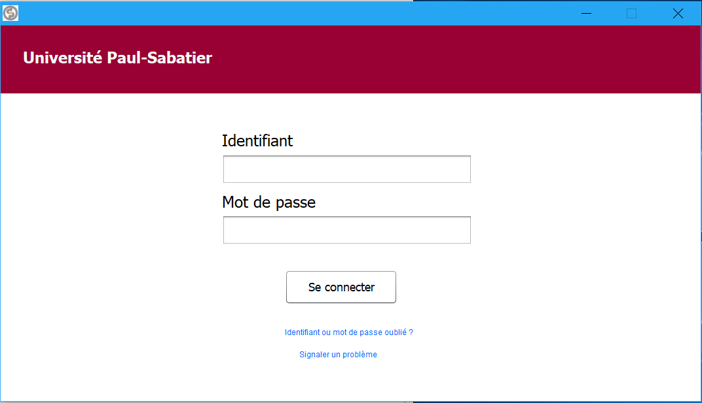
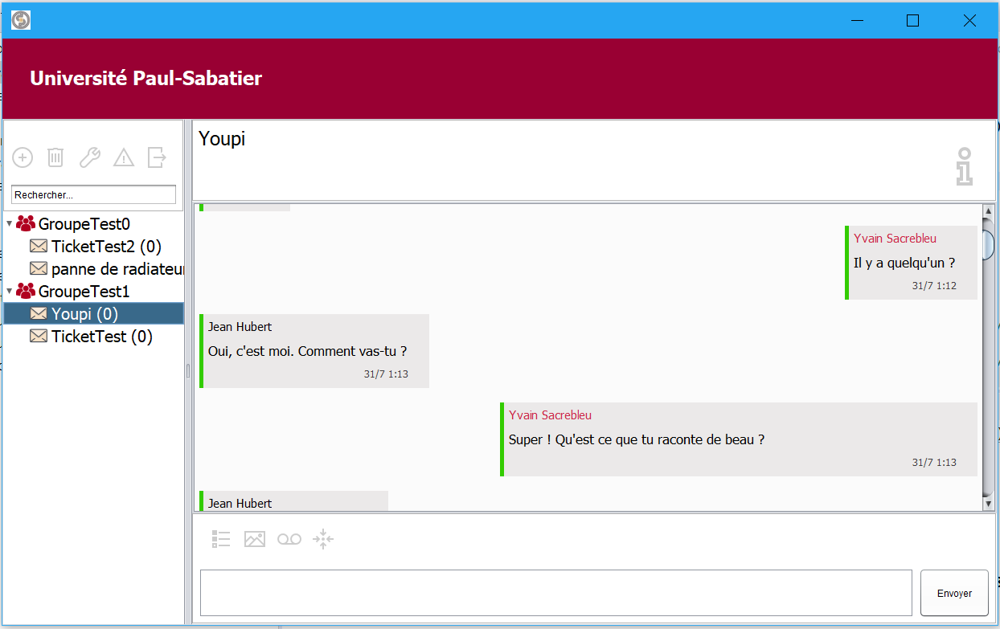
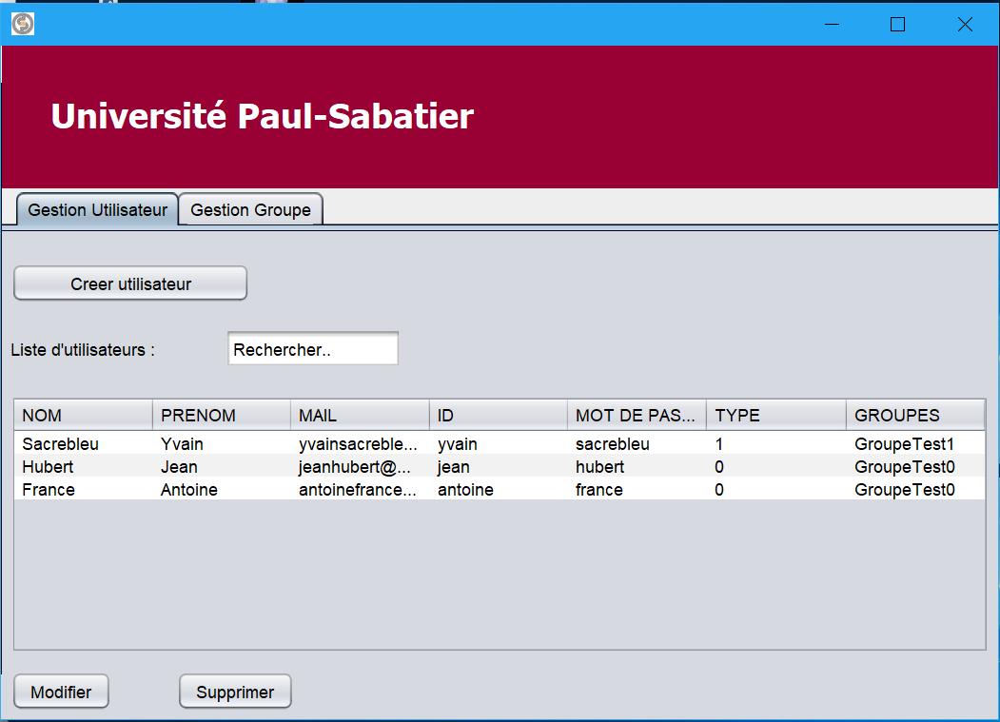

This is our own client-server application, allowing instant discussion with different groups of people.

Here, there are two types of different groups. Users can individually open a thread with a group of the opposite type, or open one with the one to which they belong. Other groups of the same type as theirs will remain unknown to them.

   
  

  
     

Features :

  - Design graphic interface
  - View the status of a message (pending, received, viewed)
  - Display users writing
  - View online / offline status of known users by the client
  - Use possible offline and attempt automatic reconnection
  - Instant broadcast by the server

The problems to solve :

  - Allow the dynamic loading of messages using the jScrollBar (The second communication already has the necessary architecture, we put in comments corresponding queries on the server side.)

 
 

     
  

